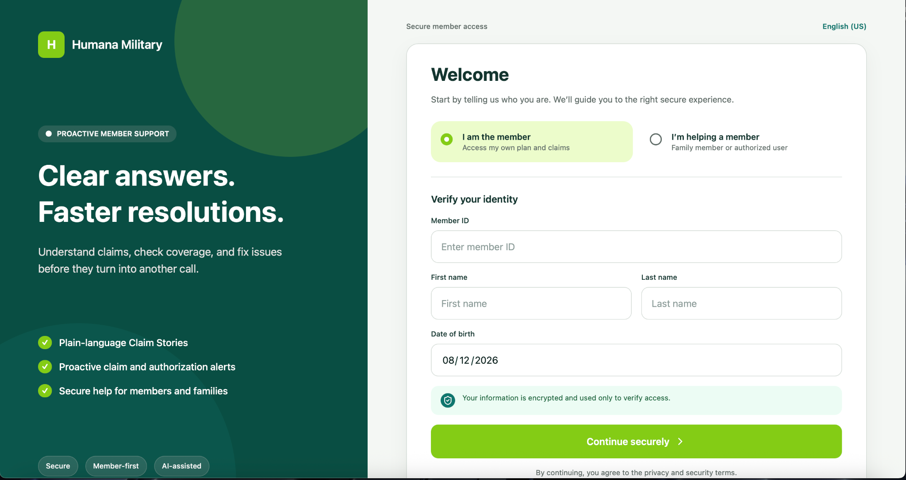
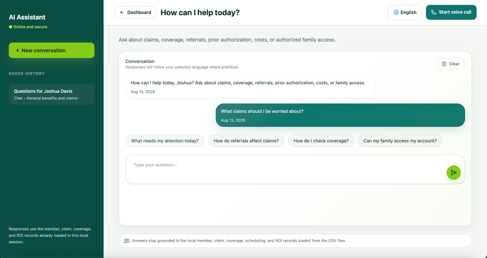
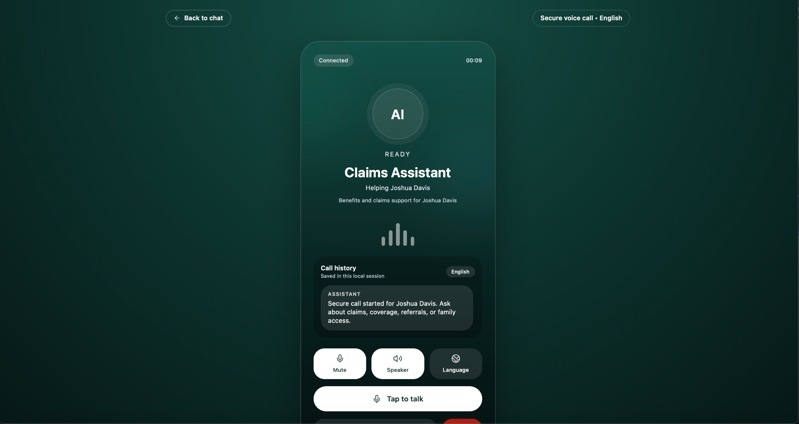

# ClaimsAssist AI — Member & Claims Intelligence

ClaimsAssist AI is a multi-agent healthcare claims intelligence platform designed to help members understand claims, coverage, costs, referrals, prior authorizations, and next steps through a unified AI-powered experience.

Built for the **Humana Hackathon**, ClaimsAssist uses a hierarchical multi-agent architecture consisting of **5 Gemini 1.5 Pro agents**: one central **Orchestrator Agent** and four specialized **Subagents** that can analyze different parts of a member request simultaneously.

Rather than routing an entire healthcare question through a single LLM workflow, ClaimsAssist decomposes complex requests into specialized tasks, executes them in parallel, and synthesizes the results into one member-friendly response.

---

## Product Experience

### Secure Member Access

Members begin through a secure identity-verification experience designed for both primary members and authorized family users.

<p align="center">
  
</p>

### Multi-Agent AI Assistant

The conversational interface gives members a single place to ask questions about claims, coverage, referrals, prior authorization, costs, and family access.

Behind the interface, the Orchestrator Agent coordinates specialized Gemini agents to analyze the request and synthesize a unified answer.

<p align="center">
  
</p>

### AI Voice Support

ClaimsAssist extends the same member-support experience to a voice interface, allowing members to interact with the claims assistant through a secure call-style experience.

<p align="center">
  
</p>

---

## Multi-Agent Architecture

The core of ClaimsAssist is a **5-agent hierarchical system**.

Each agent is implemented as a specialized **Gemini 1.5 Pro wrapper** with its own role and context.

The **Orchestrator Agent** sits at the top of the hierarchy. It receives the member's request, determines what information is needed, delegates work across four specialized agents, and combines their outputs into a final response.

```text
                              MEMBER
                                |
                                | Question
                                v
                    +-------------------------+
                    |    ORCHESTRATOR AGENT   |
                    |     Gemini 1.5 Pro      |
                    |                         |
                    |  Understands Request    |
                    |  Routes Tasks           |
                    |  Synthesizes Results    |
                    +------------+------------+
                                 |
                     Parallel Agent Execution
                                 |
          +----------------------+----------------------+
          |                      |                      |
          v                      v                      v
 +----------------+     +----------------+     +----------------+
 |   SUBAGENT 1   |     |   SUBAGENT 2   |     |   SUBAGENT 3   |
 | Gemini 1.5 Pro |     | Gemini 1.5 Pro |     | Gemini 1.5 Pro |
 |                |     |                |     |                |
 |  Specialized   |     |  Specialized   |     |  Specialized   |
 |    Analysis    |     |    Analysis    |     |    Analysis    |
 +-------+--------+     +-------+--------+     +-------+--------+
         |                      |                      |
         |              +-------+--------+             |
         |              |   SUBAGENT 4   |             |
         |              | Gemini 1.5 Pro |             |
         |              |                |             |
         |              |  Specialized   |             |
         |              |    Analysis    |             |
         |              +-------+--------+             |
         |                      |                      |
         +----------------------+----------------------+
                                |
                                | Agent Outputs
                                v
                    +-------------------------+
                    |    ORCHESTRATOR AGENT   |
                    |   Response Synthesis    |
                    +------------+------------+
                                 |
                                 v
                    +-------------------------+
                    |    UNIFIED RESPONSE     |
                    +-------------------------+
```

---

## How the Agent Hierarchy Works

1. **Member Request** — A member asks a question through the conversational or voice interface.

2. **Orchestrator Analysis** — The Gemini-powered Orchestrator determines what information is required to answer the request.

3. **Task Decomposition** — Complex requests are broken into smaller tasks that can be handled independently.

4. **Parallel Agent Execution** — Four specialized Gemini 1.5 Pro subagents can simultaneously analyze their assigned portions of the request.

5. **Response Synthesis** — Agent outputs return to the Orchestrator, which combines the relevant information into one coherent member response.

```text
Agent 1 ──┐
Agent 2 ──┤
Agent 3 ──┼──> Orchestrator ──> Unified Member Response
Agent 4 ──┘
```

---

## Why Multi-Agent?

Healthcare claims questions often span multiple domains at once. A single question may require understanding:

- Claims
- Coverage and benefits
- Referrals
- Prior authorizations
- Member costs
- Family access
- Recommended next steps

ClaimsAssist uses **specialization + orchestration** instead of requiring one general-purpose agent to handle the entire workflow sequentially.

```text
                 SINGLE AGENT

Member ──> LLM ──> Entire Problem ──> Response


                CLAIMSASSIST

                       ┌──> Agent 1 ──┐
                       ├──> Agent 2 ──┤
Member ─> Orchestrator ├──> Agent 3 ──┼──> Orchestrator ─> Response
                       └──> Agent 4 ──┘
```

This architecture provides:

- **Parallel execution** across specialized tasks
- **Separation of responsibilities** between agents
- **Centralized orchestration** of complex requests
- **Modular agent design**
- **Independent agent prompting and context**
- **Unified response synthesis**
- **Extensible AI workflows**

---

## Agent Design

All five agents are powered by **Gemini 1.5 Pro**, while each wrapper serves a different responsibility within the system.

```text
Gemini 1.5 Pro
      |
      +---- Orchestrator Agent
      |
      +---- Specialized Agent 1
      |
      +---- Specialized Agent 2
      |
      +---- Specialized Agent 3
      |
      +---- Specialized Agent 4
```

Separate wrappers allow each agent to maintain its own:

- System instructions
- Responsibilities
- Context
- Input data
- Output structure

The underlying model remains consistent while each agent performs a distinct role within the overall workflow.

---

## Member Portal

| Route | Description |
|---|---|
| `/` | Secure member access |
| `/dashboard` | Member overview and claims intelligence |
| `/claims` | Claims information |
| `/assistant` | Multi-agent AI assistant |
| `/call` | AI voice support experience |

---

## Tech Stack

### Frontend
- React
- TypeScript
- Vite
- Tailwind CSS

### AI
- Gemini 1.5 Pro
- 5-agent hierarchical architecture
- 1 Orchestrator Agent
- 4 specialized Subagents
- Parallel agent execution
- Multi-agent response synthesis

### Data
- Local member CSV data
- Local claims data

---

## Running Locally

Clone the repository:

```bash
git clone <repository-url>
cd <repository-directory>
```

If Node.js is not installed globally, use the repository-local Node runtime:

```bash
export PATH="$PWD/.local/node/v24.17.0/node-v24.17.0-darwin-arm64/bin:$PATH"
```

Install dependencies:

```bash
npm install
```

Start the development server:

```bash
npm run dev
```

Vite will display the local development URL, typically:

```text
http://localhost:5173
```

---

## Demo Member

```text
Member ID: MBR00036
First Name: Joshua
Last Name: Davis
Date of Birth: 1970-07-02
```

---

## Future Development

- Live claims and member API integrations
- Persistent member context
- Retrieval-augmented generation over policy documents
- Additional specialized agents
- Dynamic agent routing
- Agent observability and tracing
- Human escalation workflows
- Real-time member support integrations
- Secure cloud deployment

---

## Disclaimer

ClaimsAssist AI is a prototype developed for hackathon and demonstration purposes. It is not intended to provide medical advice or replace professional healthcare guidance.